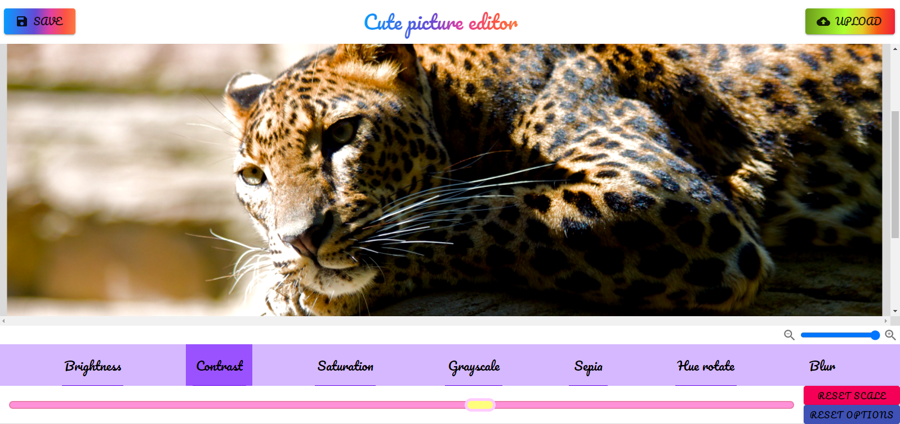

# 🎨 Cute picture editor ✨

## About

Basic and cute picture editor built with React, Typescript and Canvas 😏

## Screenshots

**Browser** & **Smartphones 📱**

  
   

## Demo

Try live version on
[GitHub-Pages](https://foxcaulfield.github.io/cute-picture-editor/)

## Technologies, libraries & services

Built with:

- React
- TypeScript
- Canvas

## Features

- Fine filter tuning
- Picture scaling
- Uploading and saving pictures
- Scale and filter reset
